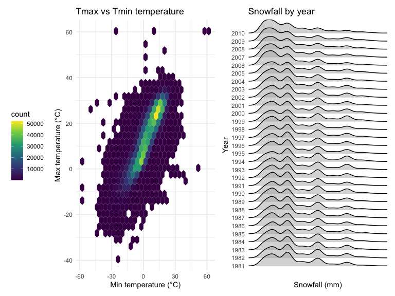

Homework 3
================
Zhenyu Zhou
2022-10-14

### Problem 1

#### Read in the data

``` r
data("instacart")

instacart = 
  instacart %>% 
  as_tibble(instacart)
```

#### Answer questions about the data

This dataset contains 1384617 rows and 15 columns, with each row
resprenting a single product from an instacart order. Variables include
identifiers for user, order, and product; the order in which each
product was added to the cart. There are several order-level variables,
describing the day and time of the order, and number of days since prior
order. Then there are several item-specific variables, describing the
product name (e.g. Yogurt, Avocado), department (e.g. dairy and eggs,
produce), and aisle (e.g. yogurt, fresh fruits), and whether the item
has been ordered by this user in the past. In total, there are 39123
products found in 131209 orders from 131209 distinct users.

Below is a table summarizing the number of items ordered from aisle. In
total, there are 134 aisles, with fresh vegetables and fresh fruits
holding the most items ordered by far.

``` r
instacart %>% 
  count(aisle) %>% 
  arrange(desc(n))
```

    ## # A tibble: 134 × 2
    ##    aisle                              n
    ##    <chr>                          <int>
    ##  1 fresh vegetables              150609
    ##  2 fresh fruits                  150473
    ##  3 packaged vegetables fruits     78493
    ##  4 yogurt                         55240
    ##  5 packaged cheese                41699
    ##  6 water seltzer sparkling water  36617
    ##  7 milk                           32644
    ##  8 chips pretzels                 31269
    ##  9 soy lactosefree                26240
    ## 10 bread                          23635
    ## # … with 124 more rows

Next is a plot that shows the number of items ordered in each aisle.
Here, aisles are ordered by ascending number of items.

``` r
instacart %>% 
  count(aisle) %>% 
  filter(n > 10000) %>% 
  mutate(aisle = fct_reorder(aisle, n)) %>% 
  ggplot(aes(x = aisle, y = n)) + 
  geom_point() + 
  labs(title = "Number of items ordered in each aisle") +
  theme(axis.text.x = element_text(angle = 60, hjust = 1))
```


Our next table shows the three most popular items in aisles
`baking ingredients`, `dog food care`, and `packaged vegetables fruits`,
and includes the number of times each item is ordered in your table.

``` r
instacart %>% 
  filter(aisle %in% c("baking ingredients", "dog food care", "packaged vegetables fruits")) %>%
  group_by(aisle) %>% 
  count(product_name) %>% 
  mutate(rank = min_rank(desc(n))) %>% 
  filter(rank < 4) %>% 
  arrange(desc(n)) %>%
  knitr::kable()
```

| aisle                      | product_name                                  |    n | rank |
|:---------------------------|:----------------------------------------------|-----:|-----:|
| packaged vegetables fruits | Organic Baby Spinach                          | 9784 |    1 |
| packaged vegetables fruits | Organic Raspberries                           | 5546 |    2 |
| packaged vegetables fruits | Organic Blueberries                           | 4966 |    3 |
| baking ingredients         | Light Brown Sugar                             |  499 |    1 |
| baking ingredients         | Pure Baking Soda                              |  387 |    2 |
| baking ingredients         | Cane Sugar                                    |  336 |    3 |
| dog food care              | Snack Sticks Chicken & Rice Recipe Dog Treats |   30 |    1 |
| dog food care              | Organix Chicken & Brown Rice Recipe           |   28 |    2 |
| dog food care              | Small Dog Biscuits                            |   26 |    3 |

Finally is a table showing the mean hour of the day at which Pink Lady
Apples and Coffee Ice Cream are ordered on each day of the week. This
table has been formatted in an untidy manner for human readers. Pink
Lady Apples are generally purchased slightly earlier in the day than
Coffee Ice Cream, with the exception of day 5.

``` r
instacart %>%
  filter(product_name %in% c("Pink Lady Apples", "Coffee Ice Cream")) %>%
  group_by(product_name, order_dow) %>%
  summarize(mean_hour = mean(order_hour_of_day)) %>%
  spread(key = order_dow, value = mean_hour) %>%
  knitr::kable(digits = 2)
```

    ## `summarise()` has grouped output by 'product_name'. You can override using the
    ## `.groups` argument.

| product_name     |     0 |     1 |     2 |     3 |     4 |     5 |     6 |
|:-----------------|------:|------:|------:|------:|------:|------:|------:|
| Coffee Ice Cream | 13.77 | 14.32 | 15.38 | 15.32 | 15.22 | 12.26 | 13.83 |
| Pink Lady Apples | 13.44 | 11.36 | 11.70 | 14.25 | 11.55 | 12.78 | 11.94 |

## Problem 2

**Load and tidy Data**

``` r
accel_df = 
  read.csv("./data/accel_data.csv") %>% 
  janitor::clean_names() %>% 
  pivot_longer(
    activity_1:activity_1440,
    names_to = "minute",
    values_to = "activity_counts",
    names_prefix = "activity_"
  ) %>% 
  mutate(
    minute = as.numeric(minute),
    day = factor(day, 
                 levels = c("Monday","Tuesday","Wednesday","Thursday","Friday","Saturday","Sunday")),
    weekday_weekend = if_else((day == "Saturday" | day == "Sunday"),"Weekend","Weekday"),
    weekday_weekend = factor(weekday_weekend, 
                             levels = c("Weekday", "Weekend"))
  ) %>% 
  relocate(week,day_id, day,weekday_weekend)
```

**Describe the resulting dataset:**

The accel_df dataset contains 50400 observations of activity
(accelerometer data), and there are 6 variables, which are week, day_id,
day, weekday_weekend, minute, activity_counts that describing the
information of data.

minute: the number of minute of a 24-hour day starting at midnight.

activity_counts: the activity count of the male collected by
accelerometer.

**Traditional analyses of accelerometer data focus on the total activity
over the day. Using your tidied dataset, aggregate across minutes to
create a total activity variable for each day, and create a table
showing these totals. Are any trends apparent?**

``` r
total_activity_data = accel_df %>% 
  group_by(week, day) %>%
  summarize(activity_total = sum(activity_counts),
            .groups = "drop") %>%
  pivot_wider(names_from = day,
              values_from = activity_total)
knitr::kable(total_activity_data)
```

| week |    Monday |  Tuesday | Wednesday | Thursday |   Friday | Saturday | Sunday |
|-----:|----------:|---------:|----------:|---------:|---------:|---------:|-------:|
|    1 |  78828.07 | 307094.2 |    340115 | 355923.6 | 480542.6 |   376254 | 631105 |
|    2 | 295431.00 | 423245.0 |    440962 | 474048.0 | 568839.0 |   607175 | 422018 |
|    3 | 685910.00 | 381507.0 |    468869 | 371230.0 | 467420.0 |   382928 | 467052 |
|    4 | 409450.00 | 319568.0 |    434460 | 340291.0 | 154049.0 |     1440 | 260617 |
|    5 | 389080.00 | 367824.0 |    445366 | 549658.0 | 620860.0 |     1440 | 138421 |

The trend in total daily activity counts changed significantly over time
over five weeks. The weekend accelerometer monitoring data has a
tendency to be much lower than the weekday data. And, the trend in total
daily activity counts changed significantly over time over five weeks.

**Make a single-panel plot that shows the 24-hour activity time courses
for each day and use color to indicate day of the week.**

``` r
accel_df %>% 
  ggplot(aes(x = minute, 
             y = activity_counts, 
             color = day)) +
  geom_line(alpha = .4) +
  scale_x_continuous(
    breaks = c(0, 180, 360, 540, 720, 900, 1080, 1260, 1440),
    labels = c("0:00", "3:00", "6:00", "9:00","12:00","15:00","18:00","21:00","24:00"),
    limits = c(0,1440)) +
  labs(title = "24-hour activity time courses per day",
       x = "Time",
       y = "Activity accelerometer data") +
  theme(plot.title = element_text(hjust = 0.5))
```


From the graph, we can calculate that this male’s activity count
increased around 11am to 12pm and 7pm to 10pm.

### Problem 3

**Clean and load data from ny_noaa.**

``` r
library(p8105.datasets)
data("ny_noaa")
```

This dataset provides weather data from weather stations in New York
State from 1981 to 2010. This dataset has 2595176 rows and 7 columns.

This dataset contains variables: id, date, prcp, snow, snwd, tmax, tmin.

`id`: weather station ID, `date`: date of observation, `prcp`:
precipitation, `snow`: snowfall, `snwd`: snow depth, `tmax`: maximum
temperature, and `tmin`: minimum temperature.

The dataset contains a lot of missing data, especially for `tmax` and
`tmin`.

**Clean data, create variables and wrangle data**

``` r
noaa_clean =   
  ny_noaa %>% 
  janitor::clean_names() %>% 
  separate(date, into = c("year", "month", "day", sep = "-")) %>% 
  mutate(
    month = month.name[as.integer(month)],
    prcp = prcp * 0.1,
    tmax = as.integer(tmax) * 0.1,
    tmin = as.integer(tmin) * 0.1
  )
```

``` r
noaa_clean %>% 
  count(snow) %>% 
  arrange(desc(n))
```

    ## # A tibble: 282 × 2
    ##     snow       n
    ##    <int>   <int>
    ##  1     0 2008508
    ##  2    NA  381221
    ##  3    25   31022
    ##  4    13   23095
    ##  5    51   18274
    ##  6    76   10173
    ##  7     8    9962
    ##  8     5    9748
    ##  9    38    9197
    ## 10     3    8790
    ## # … with 272 more rows

The most commonly observed value is 0, since most of the year does not
snow.

**Make a two-panel plot showing the average max temperature in January
and in July in each station across years. Is there any observable /
interpretable structure? Any outliers?**

``` r
noaa_clean %>% 
  filter(month %in% c("January", "July")) %>% 
  group_by(month, id, year) %>% 
  summarise(mean_tmax = mean(tmax, na.rm = TRUE)
  ) %>% 
  ggplot(aes(x = as.integer(year), y = mean_tmax, group = id,color = month)) +
  geom_line(alpha = 0.3) +
  facet_grid(. ~ month, scales = "free") +
  labs(
    x = "Year",
    y = "Average Max Temperature (°C)",
    title = "Average daily maximum temperature in New York State"
  ) +
  theme(legend.position = "none")
```

    ## `summarise()` has grouped output by 'month', 'id'. You can override using the
    ## `.groups` argument.


The average maximum temperature in January is between -10-10°C. The
average maximum temperature in July is between 20-32°C. The change in
tmax in January is greater than that in July. The most outlier in
January is around -14°C and the most outlier in July is around 13°C.

**Make a two-panel plot showing (i) tmax vs tmin for the full dataset
(note that a scatterplot may not be the best option); and (ii) make a
plot showing the distribution of snowfall values greater than 0 and less
than 100 separately by year.**

``` r
p_tmax_tmin =   
  noaa_clean %>% 
  ggplot(aes(x = tmin, y = tmax)) +
  geom_hex() +
  labs(
    x = "Min Temperature (°C)",
    y = "Max Temperature (°C)"
  ) +
  theme(legend.position = "left")

p_snowfall =
  noaa_clean %>% 
  filter(snow > 0 & snow < 100) %>% 
  group_by(year) %>%
  ggplot(aes(x = snow, y = year)) +
  geom_density_ridges() +
  labs(
    title = "Snowfall by year",
    x = "Snowfall (mm)",
    y = "Year",
    caption = "Data from snowfall value (0~100 mm)"
  ) +
  scale_x_continuous(
    breaks = c(0,25,50,75,100)) +
  scale_y_discrete(
    position = "left") +
  viridis::scale_fill_viridis() 

p_tmax_tmin + p_snowfall
```

    ## Picking joint bandwidth of 3.76


